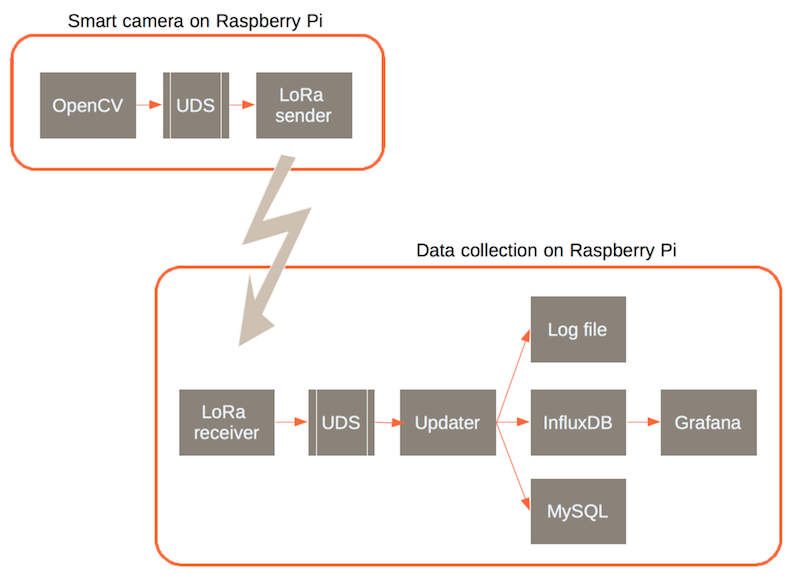
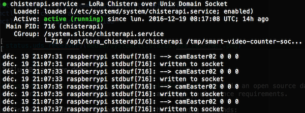

# LoRa setup

On this page you will find instructions to install two Raspberry Pi connected over [LoRa](https://www.lora-alliance.org/What-Is-LoRa/Technology).



The LoRa protocol is a physical layer (PHY- OSI Layer 1) wireless component.
LoRa is a unique (and awesome) modulation format that can be generated by Semtech LoRa parts, including the SX1272 and SX1276 transceiver chips. This modulation format is best described as a “frequency modulated (FM) chirp.” The core IP that enables LoRa is the ability to generate a stable chirp using a frac-N phase lock loop (PLL).
It is important to remember when asking “What is LoRa,” that LoRa itself does not describe system functionality above the physical (RF medium) layer.

One Raspberry Pi is setup as a smart camera. It features:
- a Raspberry camera, of course,
- the scanning software powered by OpenCV,
- a Chistera-Pi shield for LoRa communications

Another Raspberry Pi is setup as datastore. It features:
- a Chistera-Pi shield for LoRa communications,
- an InfluxDB database,
- a Grafana web dashboard

Note that this architecture supports multiple cameras. Real-time data is consolidated wirelessly on a single visual dashboard.

## Install LoRa shield

Each Raspberry Pi is communicating over LoRa. In this design you will add a [Chistera-Pi](http://snootlab.com/shields-snootlab/1152-chistera-pi-12-lora-accessoires-fr.html) shield to every device.
After power on you activate serial communications with the shield:

```
sudo raspi-config
```

Then select `9 - Advanced Options` then `A5 - SPI`. Confirm your choice and exit the configuration tool.

Note that you can always check [most recent setup instructions](https://github.com/Snootlab/lora_chisterapi) from the site of [Snootlab](http://snootlab.com/), the creator of Chistera-Pi.

## Install camera software

Connect over SSH to each target Raspberry Pi and apply following commands:

```
sudo mkdir -p /opt
cd /opt
sudo git clone https://github.com/bernard357/smart-video-counter.git
sudo chmod 0777 -R /opt/smart-video-counter
cd smart-video-counter
pip install -r requirements.txt
cd source
```

You will immediately change the id of each camera to ensure that it is unique:

```
sudo nano config.py
```

The camera id will be transmitted with counter values, and appear in the
database and reports. You should avoid spaces and special punctuation characters.


Save changes with `Ctl-O` and exit the editor with `Ctl-X`.

## Install LoRa sender software

Get the source of the software, and compile it, with following commands:

```
cd /opt
sudo git clone https://github.com/bernard357/lora_chisterapi.git
sudo chmod 0777 -R /opt/lora_chisterapi
cd lora_chisterapi
cp examples/uds_sender.cpp src/main.cpp
make
```

If the compilation went fine, then configure a service that will run
in the background and send data over LoRa:

```
sudo cp examples/uds_chisterapi.service.example /etc/systemd/system/chisterapi.service
sudo chmod 664 /etc/systemd/system/chisterapi.service
sudo systemctl enable /etc/systemd/system/chisterapi.service
sudo systemctl start chisterapi.service
sudo systemctl status chisterapi.service
```


## Install the scanner service

The scanner is powered by [OpenCV](http://opencv.org/). It is the sub-system that analyses in real-time the flow of images coming from the camera
and generates counters every 2 seconds: number of persons, number of moves, and number of human faces detectd.

Install the scanner service with following commands:

```
sudo cp /opt/smart-video-counter/scripts/smart-video-counter.service.example /etc/systemd/system/smart-video-counter.service
sudo chmod 664 /etc/systemd/system/smart-video-counter.service
```

Now you can enable the new service, start it, and get feedback:

```
sudo systemctl enable /etc/systemd/system/smart-video-counter.service
sudo systemctl start smart-video-counter.service
sudo systemctl status smart-video-counter.service
```

If everything went fine, the system should report a successful start:


That's it for the camera itself. Now we move to the datastore.

## Install datastore software

Connect over SSH to the Raspberry Pi used for datastore and apply following commands:

```
sudo mkdir -p /opt
cd /opt
sudo git clone https://github.com/bernard357/smart-video-counter.git
sudo chmod 0777 -R /opt/smart-video-counter
cd smart-video-counter
pip install -r requirements.txt
cd source
```

## Install InfluxDB to store data

[InfluxDB](https://www.influxdata.com/time-series-platform/influxdb/) is an open source database written in Go specifically to handle time series data with high availability and high performance requirements.

We install an InfluxDB database on Raspberry Pi with following commands:

```
sudo su
adduser influxdb
wget https://dl.influxdata.com/influxdb/releases/influxdb-1.1.1_linux_armhf.tar.gz
tar xvfz influxdb-1.1.1_linux_armhf.tar.gz
rm influxdb-1.1.1_linux_armhf.tar.gz
cp -rp influxdb-1.1.1-1/* /
chown -R influxdb:influxdb /var/lib/influxdb
chown -R influxdb:influxdb /var/log/influxdb
cp -n /usr/lib/influxdb/scripts/influxdb.service /etc/systemd/system/
systemctl enable influxdb.service
cp -n /usr/lib/influxdb/scripts/init.sh /etc/init.d/influxdb
chmod +x /etc/init.d/influxdb
insserv influxdb
service influxd start
service influxd status
```

If everything went fine, you could get positive feedback on the InfluxDB service:


## Configure the InfluxDB updater

Then we change the configuration of the system so that updates are sent to InfluxDB.
Uncomment the block referring to infludb.

```
nano config.py
```


## Install the updater service

The updater service handles measurements coming from cameras, and pushes them to InfluxDB.
Install the updater service with following commands:

```
sudo cp ../scripts/updater.service.example /etc/systemd/system/updater.service
sudo chmod 664 /etc/systemd/system/updater.service
```

Now you can enable the new service, start it, and get feedback:

```
sudo systemctl enable /etc/systemd/system/updater.service
sudo systemctl start updater.service
sudo systemctl status updater.service
```

If everything went fine, the system should report a successful start:


## Install LoRa receiver software

Get the source of the software, and compile it, with following commands:

```
cd /opt
sudo git clone https://github.com/bernard357/lora_chisterapi.git
sudo chmod 0777 -R /opt/lora_chisterapi
cd lora_chisterapi
cp examples/uds_receiver.cpp src/main.cpp
make
```

If the compilation went fine, then we will configure a service that will run
in the background and receive data from LoRa:

```
sudo cp examples/uds_chisterapi.service.example /etc/systemd/system/chisterapi.service
sudo chmod 664 /etc/systemd/system/chisterapi.service
sudo systemctl enable /etc/systemd/system/chisterapi.service
sudo systemctl start chisterapi.service
sudo systemctl status chisterapi.service
```



After some time we can verify the presence of data in the InfluxDB database:

```
influx
> show databases
> use smart-video-counter
> show series
> select * from "smart-counter"
```

If you have multiple lines of text, you can congratulate yourself!

```
> exit
```

## Install Grafana

[Grafana](http://grafana.org/) is an open source metric analytics & visualization suite. It is most commonly used for visualizing time series data for infrastructure and application analytics but many use it in other domains including industrial sensors, home automation, weather, and process control.

Currently there are multiple steps to install Grafana on Raspberry Pi, so let do that progressively:

```
# grafana data is a dependancy for grafana
sudo apt-get install -y fonts-font-awesome libjs-angularjs libjs-twitter-bootstrap
wget http://ftp.us.debian.org/debian/pool/main/g/grafana/grafana-data_2.6.0+dfsg-3_all.deb
sudo dpkg -i grafana-data_2.6.0+dfsg-3_all.deb
sudo apt-get install -f

sudo apt-get install -y golang-go golang-go-linux-arm golang-go.tools golang-src
wget http://ftp.us.debian.org/debian/pool/main/g/grafana/grafana_2.6.0+dfsg-3_armhf.deb
sudo dpkg -i grafana_2.6.0+dfsg-3_armhf.deb
sudo apt-get install -f
sudo systemctl start grafana-server.service
sudo systemctl status grafana-server.service
```

On successful start of the server, open a browser window and enter
the IP address used for SSH communications with the datastore Raspberry Pi, followed by `:3000`.

```
http://<ip_of_raspberry>:3000
```

This will display the login page of Grafana. From there you can authenticate with `admin` and `admin` then add a new data source and build a dashboard.

Click on the Grafana logo and then select Data Sources. Select a source of type InfluxDB and then pick up the database named `smart-video-counter`.


Then add a new dashboard and add one graph per measure: standing, moves, faces.


This example shows how to configure Grafana so that each camera has a separate line on the graph.
