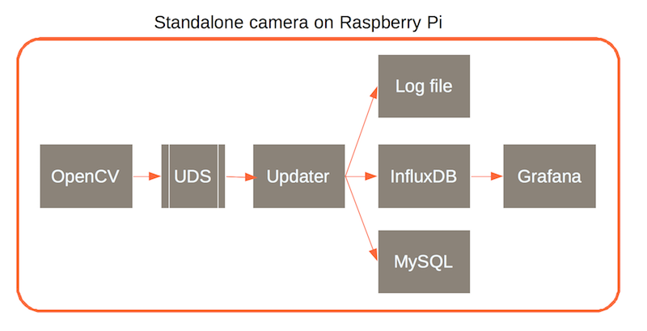
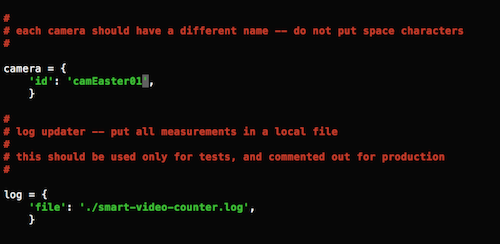
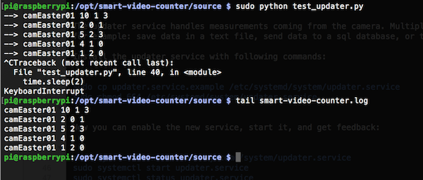
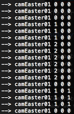
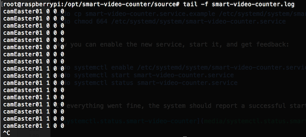
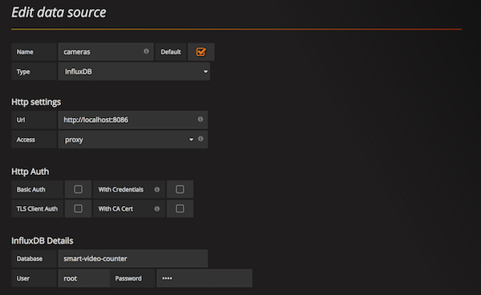
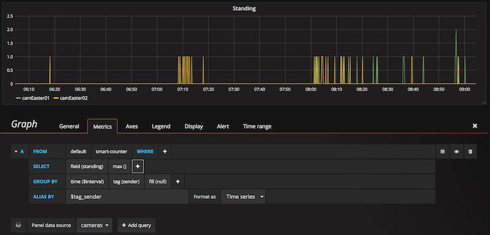

# Standalone setup

On this page you will find instructions to install a standalone camera.
Everything you need is installed on a single Raspberry Pi device:
- the camera itself
- the scanning software powered by OpenCV
- the InfluxDB database
- the Grafana web dashboard



With this architecture, use the network address of the Raspberry Pi itself
to access live data in Grafana.

## Install camera software

Connect over SSH to the target Raspberry Pi and apply following commands:

```
sudo mkdir -p /opt
cd /opt
sudo git clone https://github.com/bernard357/smart-video-counter.git
sudo chmod 0777 -R /opt/smart-video-counter
cd smart-video-counter
pip install -r requirements.txt
cd source
```

You will immediately change the id of your camera to ensure that it is unique:

```
sudo nano config.py
```

The camera id will be transmitted with counter values, and appear in the
database and reports. You should avoid spaces and special punctuation characters.



Save changes with `Ctl-O` and exit the editor with `Ctl-X`.

## Install the updater service

The updater service handles measurements coming from the camera. Multiple options can be considered,
for example: save data in a text file, send data to a sql database, or to an InfluxDB database.

Install the updater service with following commands:

```
sudo cp ../scripts/updater.service.example /etc/systemd/system/updater.service
sudo chmod 664 /etc/systemd/system/updater.service
```

Now you can enable the new service, start it, and get feedback:

```
sudo systemctl enable /etc/systemd/system/updater.service
sudo systemctl start updater.service
sudo systemctl status updater.service
```

If everything went fine, the system should report a successful start:


The service can be tested by sending some fake measurements, like this:

```
sudo python test_updater.py
```

The actual id of the camera should be listed. When enough samples have been
thrown, hit `Ctl-C` to interrupt the process. Then check the log and ensure that
samples get there.



Congratulations! At this stage your system can handle measurements in the background.
Now we will setup the camera counter itself.

## Test the scanner

The scanner gets pictures from the camera, performs various analysis, and send counters
to the updater.

Test the scanner from the command line:

```
python smart-video-counter.py
```

Stand in front of the camera at a distance of at least 2 meters, and then
get closer and show your face to the camera. The first number should reflect
the number of persons, and the third one the number of faces. In the example
below the camera detected that we were two persons queuing, then I moved and
presented my face.



## Install the scanner service

Install the scanner service with following commands:

```
sudo cp ../scripts/smart-video-counter.service.example /etc/systemd/system/smart-video-counter.service
sudo chmod 664 /etc/systemd/system/smart-video-counter.service
```

Now you can enable the new service, start it, and get feedback:

```
sudo systemctl enable /etc/systemd/system/smart-video-counter.service
sudo systemctl start smart-video-counter.service
sudo systemctl status smart-video-counter.service
```

If everything went fine, the system should report a successful start:


At this stage, the camera is scanning images, and reporting measurements in a log file.
Look in real-time at the log file while standing in front of the camera:



Great! The camera is working as expected. Now we can change the configuration and put data in a real database.

## Install InfluxDB to store data

[InfluxDB](https://www.influxdata.com/time-series-platform/influxdb/) is an open source database written in Go specifically to handle time series data with high availability and high performance requirements.

We install an InfluxDB database on the Raspberry Pi itself with following commands:

```
sudo su
adduser influxdb
wget https://dl.influxdata.com/influxdb/releases/influxdb-1.1.1_linux_armhf.tar.gz
tar xvfz influxdb-1.1.1_linux_armhf.tar.gz
rm influxdb-1.1.1_linux_armhf.tar.gz
cp -rp influxdb-1.1.1-1/* /
chown -R influxdb:influxdb /var/lib/influxdb
chown -R influxdb:influxdb /var/log/influxdb
cp -n /usr/lib/influxdb/scripts/influxdb.service /etc/systemd/system/
systemctl enable influxdb.service
cp -n /usr/lib/influxdb/scripts/init.sh /etc/init.d/influxdb
chmod +x /etc/init.d/influxdb
insserv influxdb
service influxd start
service influxd status
```

If everything went fine, you could get positive feedback on the InfluxDB service:


## Configure the InfluxDB updater

We change the configuration of the system so that updates are sent to InfluxDB too.
Uncomment the block referring to infludb.

```
nano config.py
```


Save changes with `Ctl-O` and exit with `Ctl-X`. Then restart the updater so that the new configuration is used:

```
systemctl restart updater.service
```

After some time we can verify the presence of data in the InfluxDB database:

```
influx
> show databases
> use smart-video-counter
> show series
> select * from "smart-counter"
```

If you have multiple lines of text, you can congratulate yourself!

```
> exit
```

## Install Grafana

[Grafana](http://grafana.org/) is an open source metric analytics & visualization suite. It is most commonly used for visualizing time series data for infrastructure and application analytics but many use it in other domains including industrial sensors, home automation, weather, and process control.

Currently there are multiple steps to install Grafana on Raspberry Pi, so let do that progressively:

```
# grafana data is a dependancy for grafana
sudo apt-get install -y fonts-font-awesome libjs-angularjs libjs-twitter-bootstrap
wget http://ftp.us.debian.org/debian/pool/main/g/grafana/grafana-data_2.6.0+dfsg-3_all.deb
sudo dpkg -i grafana-data_2.6.0+dfsg-3_all.deb
sudo apt-get install -f

sudo apt-get install -y golang-go golang-go-linux-arm golang-go.tools golang-src
wget http://ftp.us.debian.org/debian/pool/main/g/grafana/grafana_2.6.0+dfsg-3_armhf.deb
sudo dpkg -i grafana_2.6.0+dfsg-3_armhf.deb
sudo apt-get install -f
sudo systemctl start grafana-server.service
sudo systemctl status grafana-server.service
```

On successful start of the server, open a browser window and enter
the IP address of the raspberry Pi, followed by `:3000`.

This will display the login page of Grafana. From there you can authenticate with `admin` and `admin` then add a new data source and build a dashboard.

Click on the Grafana logo and then select Data Sources. Select a source of type InfluxDB and then pick up the database named `smart-video-counter`.



Then add a new dashboard and add one graph per measure: standing, moves, faces.




